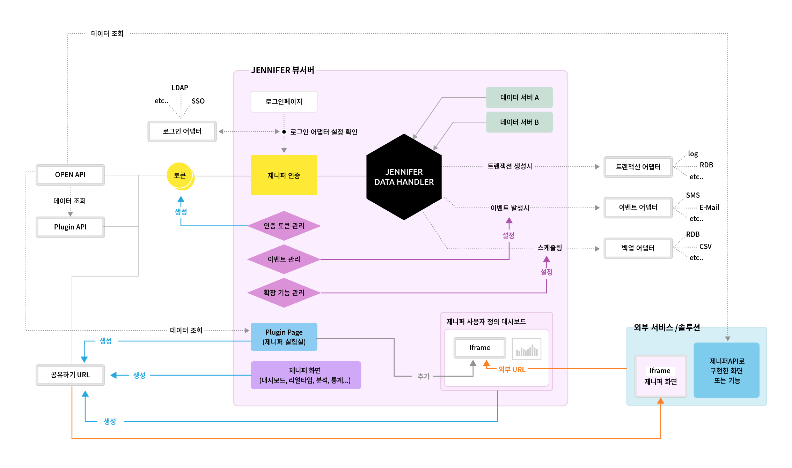

# Development Guide Overview

JENNIFER seeks to be a platform that can provide a variety of expansion features.
This Guide is aimed to provide you with the necessary information to get started with developing JENNIFER extensions.

## Type of Extensions
There are several ways to extend JENNIFER functionality.
The following figure shows an overview of the JENNIFER Extension Architecture.

 the following is a summary of the JENNIFER extensions

### 1- 어댑터
JENNIFER Server Adapter is an external module that can process transaction data or EVENT notification in real time. JENNIFER Server Adapter also allows users to create a variety of services in conjunction with E-Mail or SMS modules as with Open API. In addition, real-time transaction data, which may have a large amount of data depending on the environment, can be backed up or customized without significantly affecting the performance of the Jennifer server.

### 2- 플러그인
JENNIFER View Server plug-in is an extension that developers can implement in an independent development environment, which now provides a page and API type. A page type is a screen function such as the analysis screen or the statistic screen, and an API type is a feature that provides data in a particular format, such as the Open API. JENNIFER View Server Plugin mainly used for prototyping purposes prior to development with official features and has recently been in use to make the screen linkage with other monitoring solutions.

### 3- 배치(백업)
Jennifer Server Batch is an extension that is used to export statistical data in batches at specific times. The statistical data provided are Metrics and Application Service. It can be used to backup statistical data to an RDB such as Oracle or MS-SQL or exporting it as a CSV file.

> The next chapter describes in details how to use each of the above-mentioned extensions types.