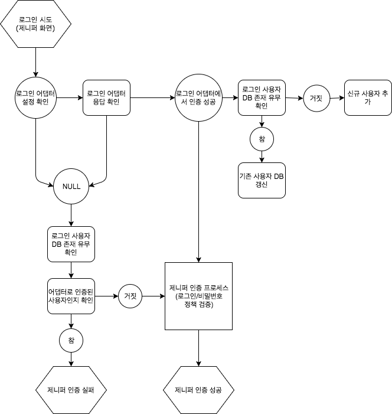

# 제니퍼 서버 어댑터

제니퍼 서버 어댑터란 트랜잭션 데이터나 EVENT 알림을 실시간으로 처리할 수 있는 외부 모듈을 말한다.제니퍼 서버 어댑터를 이용해 공개 API와 마찬가지로 E-Mail이나 SMS 모듈 등과 연동하여 다양한 서비스를 만들 수도 있다. 또한 환경에 따라 데이터 양이 많을 수도 있는 실시간 트랜잭션 데이터를 제니퍼 서버 성능에 별다른 영향없이 백업을 하거나 커스터마이징 하여 사용할 수도 있다.

### 버전 요구사항

본 문서는 제니퍼 서버 버전 5.4.0을 기준으로 작성되었다.


## IntelliJ에서 어댑터 개발환경 구성하기

5.4.0 버전부터는 제니퍼 뷰서버가 설치되어 있지 않아도 메이븐 디펜던시 하나만 추가하면 어댑터를 구현할 수 있게 되었다.

1. File > New > Project... > Maven을 선택하여, 새로운 프로젝트를 생성한다.
2. GroupId와 ArtifactId를 자신의 프로젝트에 맞게 넣어주고, Next 버튼을 클릭면 프로젝트가 생성된다.
3. src/main/java 디렉토리에 GroupId.ArtifactId 구조로 어댑터 클래스가 추가될 패키지를 생성하자.
4. com.aries.extension 라이브러리와 빌드 관련 메이븐 플러그인에 대한 설정 코드를 [pom.xml](https://github.com/jennifersoft/jennifer-view-adapter-tutorial/blob/master/pom.xml)에 추가하자.
> 참고로 GroupdId는 플러그인과 달리 임의로 설정해도 상관없지만 com.aries를 사용할 것을 권장한다.


## X-View 트랜잭션 어댑터

실시간 X-View 차트에 나오는 트랜잭션 데이터를 어댑터 핸들러를 통해 실시간으로 받을 수 있다. 예를 들어 트랜잭션 데이터를 제니퍼 DB만이 아닌 별도의 데이터베이스에 저장하고 싶을 때, 어댑터 핸들러에 관련된 코드를 추가하면 된다. X-View 트랜잭션 어댑터 클래스 코드는 다음과 같다.

```java    
package com.aries.tutorial;

import com.aries.extension.data.TransactionData;
import com.aries.extension.handler.TransactionHandler;
import com.aries.extension.util.PropertyUtil;

public class TransactionAdapter implements TransactionHandler {
    @Override
    public void on(TransactionData[] transactions) {
        System.out.println("[TransactionAdapter] - " +
                PropertyUtil.getValue("transaction_adapter", "subject", "Unknown subject"));

        for(TransactionData data : transactions) {
            System.out.println("Domain ID : " + data.domainId);
            System.out.println("Instance Name : " + data.instanceName);
            System.out.println("Transaction ID : " + data.txid);
            System.out.println("Response Time : " + data.responseTime);
            System.out.println("Application : " + data.applicationName);
        }
    }
}
```

아래는 TransactionData 클래스의 프로퍼티 목록이다.

| 변수 타입 | 프로퍼티 이름 |
|:-------|-------:|
| short | domainId |
| String | domainName |
| int | instanceId |
| String | instanceName |
| String | guid |
| String | clientIp |
| long | clientId |
| String | userId |
| int | networkTime |
| int | frontendTime |
| long | startTime |
| long | endTime |
| int | responseTime |
| int | cpuTime |
| int | sqlTime |
| int | fetchTime |
| int | externalcallTime |
| String | errorType |
| String | applicationName |
| long | txid |

## Event 알림 어댑터

EVENT 발생 시점에 관련된 데이터를 어댑터 핸들러를 통해 받기 위해서는 [관리 > EVENT 룰] 메뉴에서 설정된 값의 외부연동이 활성화되어 있어야 한다. EVENT 알림 어댑터 클래스 코드는 다음과 같다.

```java
package com.aries.tutorial;

import com.aries.extension.data.EventData;
import com.aries.extension.handler.EventHandler;
import com.aries.extension.util.PropertyUtil;

public class EventAdapter implements EventHandler {
    @Override
    public void on(EventData[] events) {
        System.out.println("[EventAdapter] - " +
                PropertyUtil.getValue("event_adapter", "subject", "Unknown subject"));

        for(EventData data : events) {
            System.out.println("Domain ID : " + data.domainId);
            System.out.println("Instance Name : " + data.instanceName);
            System.out.println("Transaction ID : " + data.txid);
            System.out.println("Service Name : " + data.serviceName);
            System.out.println("Error Type : " + data.errorType);
            System.out.println("Event Level : " + data.eventLevel);
        }
    }
}
```

아래는 EventData 클래스의 프로퍼티 목록이다.

| 변수 타입 | 프로퍼티 이름 |
|:-------|-------:|
| short | domainId |
| String | domainName |
| int | instanceId |
| String | instanceName |
| long | time |
| String | errorType |
| String | metricsName |
| String | eventLevel |
| String | message |
| double | value |
| String | otype |
| String | detailMessage |
| String | serviceName |
| long | txid |

## 사용자 인증 어댑터

제니퍼 뷰서버에서 로그인을 시도할 때, 외부 모듈에서 인증 로직을 수행할 수 있는 확장 기능이다. 사용자는 제니퍼 뷰서버의 계정 정보를 사용하지 않고, SSO 인증 방식같이 자신들이 이미 구축해둔 계정 정보를 그대로 사용할 수 있다. 

### 사용자 인증 프로세스

제니퍼의 인증 방식은 크게 두가지이다. 제니퍼 DB에서 사용자 정보를 가져와서 인증하는 전통적인 방법과 로그인 어댑터를 통한 인증 방법이 있다. 로그인 어댑터는 고객사마다 인증 방식이 다르기 보다 쉽게 커스터마이징 할 수 있도록 설계되었다.



#### preHandle 메소드

사용자가 입력한 ID와 비밀번호를 기반으로 미리 구축해둔 인증 로직을 통해 검증한다. 만약에 인증이 실패한다면 null 값을 리턴하면 되고, 성공한다면 User 객체를 생성하여, 관련된 값들을 지정하여 리턴하면 된다.

#### redirect 메소드

인증이 성공하면 사용자가 최초에 보여지는 화면을 redirect 메소드를 통해 정할 수 있다.

```java
package com.aries.tutorial;

import com.aries.extension.data.UserData;
import com.aries.extension.handler.LoginHandler;
import com.aries.extension.util.PropertyUtil;

public class LoginAdapter implements LoginHandler {
    @Override
    public UserData preHandle(String id, String password) {
        System.out.println("[LoginAdapter] - " +
                PropertyUtil.getValue("login_adapter", "subject", "Unknown subject"));

        if(id.equals("user1") && password.equals("password1")) {
            return new UserData(id, password, "admin", "Tester");
        }

        return null;
    }

    @Override
    public String redirect(String id, String password) {
        return "/dashboard/realtimeAdmin";
    }
}
```

아래는 UserData 클래스의 프로퍼티 목록이며, 각각의 프로퍼티 값들은 제니퍼 사용자 DB에 저장되며 뷰서버 화면에서 확인할 수 있다.

| 변수 타입 | 프로퍼티 이름 |
|:-------|-------:|
| String | id |
| String | password |
| String | groupId |
| String | name |
| String | email |
| String | company |
| String | dept |
| String | jobTitle |
| String | cellphone |

## 사용자 정의 옵션 사용하기

제니퍼 뷰서버의 관리 > 어댑터 및 실험실에서 직접 구현한 어댑터를 추가할 수 있는데, 이때 ID를 필수적으로 입력해야한다. 이 값은 어댑터 핸들러를 구현할 때, 사용자정의 옵션을 가져오기 위한 ID이다.


추가한 어댑터를 선택하면 사용자정의 옵션을 설정할 수 있는 버튼이 노출된다. 예전에는 별도로 properties 파일을 만들어서 옵션을 어댑터에서 직접 참조했었는데, 이제는 제니퍼 뷰서버 관리 화면을 통해 동적으로 추가/수정/삭제할 수 있다.


설정된 사용자정의 옵션들은 아래와 같이 어댑터 핸들러 구현시 사용할 수 있다. 첫번째 변수는 앞에서 어댑터를 추가할 때, 입력한 ID이며, 두번째 변수는 사용자정의 옵션키이다. 마지막 세번째 변수는 해당 키의 값이 없을 경우에 대신 추가되는 기본값이다.

## 뷰서버 옵션 사용하기

제니퍼 뷰서버의 server_view.conf 설정 파일에 정의된 옵션 값을 어댑터 내에서 사용할 수 있다. 첫번째 매개변수는 키 이름이고, 두번째는 값이 없을 때, 반환되는 기본 값이다.

```java
String db_path = com.aries.extension.util.ConfigUtil.getValue("db_path", "../db_view");
```