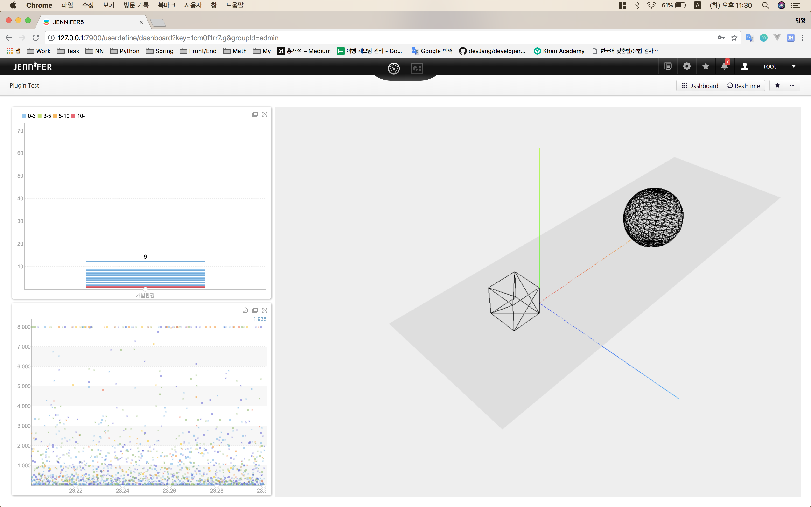
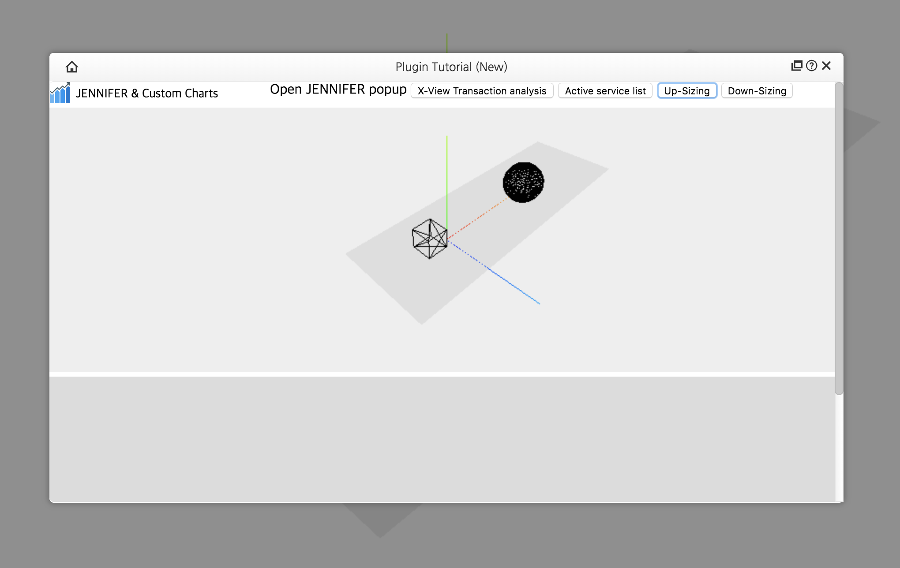

# 제니퍼 서버 플러그인

제니퍼 서버 플러그인이란 개발자가 독립적인 개발 환경에서 구현할 수 있는 확장 기능이며, 현재는 페이지와 API 타입을 제공한다. 페이지 타입은 분석이나 통계 같은 화면 기능이고, API 타입은 Open API와 같이 특정 포맷의 데이터를 제공하는 기능이다. 주로 공식 기능으로 개발하기 전에 프로토타입 용도로 활용되고 있으며, 최근에는 다른 모니터링 솔루션과의 화면 연동을 하기 위해 사용되고 있다.

### 버전 요구사항

본 문서는 제니퍼 서버 버전 5.4.1을 기준으로 작성되었다.

## IntelliJ에서 플러그인 개발환경 구성하기

 1. File > New > Project 클릭
 2. Spring Initialzr > Project SDK 선택 (1.8) > Next 클릭
 3. Project Metadata 입력 > Type 선택 (Maven Project) > Next 클릭
 3-1. Group은 com.aries로 입력해야 하고, Artifact는 자신의 프로젝트에 맞게 추가하면 된다.
 4. Dependencies 입력 > Spring Boot 버전 선택 (1.5.15) > 라이브러리 선택

## 메이븐 설정하기

다음 코드는 필수 라이브러리를 로드하기 위한 의존성 설정 부분이고, 나머지 빌드 관련은 본 프로젝트에서 배포하는 [pom.xml](https://github.com/jennifersoft/jennifer-view-plugin-tutorial/blob/master/pom.xml) 파일을 참고하자.
```xml
<dependencies>
	<!-- TODO: 사용자가 필요한 라이브러리 추가하는 영역 -->

	<!-- 제니퍼 플러그인을 구현하기 위한 필수 라이브러리 -->
	<dependency>
		<groupId>org.springframework.boot</groupId>
		<artifactId>spring-boot-starter-web</artifactId>
		<scope>provided</scope>
	</dependency>
	<dependency>
		<groupId>org.springframework.boot</groupId>
		<artifactId>spring-boot-devtools</artifactId>
		<scope>provided</scope>
		<optional>true</optional>
	</dependency>
	<dependency>
		<groupId>org.springframework.boot</groupId>
		<artifactId>spring-boot-starter-test</artifactId>
		<scope>test</scope>
	</dependency>
	<dependency>
		<groupId>com.aries</groupId>
		<artifactId>extension</artifactId>
		<version>1.2.1</version>
	</dependency>
</dependencies>
```

## 플러그인 구현하기

### 메인 클래스 수정하기

제니퍼 확장 라이브러리에서 제공하는 스프링 인터셉터를 추가하기 위해 WebMvcConfigurer 인터페이스를 메인 클래스에 다음과 같이 구현해야 한다.
```java
package com.aries.tutorial

import com.aries.extension.starter.PluginStarter;
import org.springframework.boot.SpringApplication;
import org.springframework.boot.autoconfigure.SpringBootApplication;
import org.springframework.web.servlet.config.annotation.InterceptorRegistry;
import org.springframework.web.servlet.config.annotation.WebMvcConfigurerAdapter;

@SpringBootApplication
public class PluginTutorialApplication extends WebMvcConfigurerAdapter {
	@Override
	public void addInterceptors(InterceptorRegistry registry) {
		// PluginStarter 클래스를 스프링 기본 인터셉터로 추가한다.
		registry.addInterceptor(new PluginStarter()).addPathPatterns("/plugin/**");
	}

	public static void main(String[] args) {
		SpringApplication.run(PluginTutorialApplication.class, args);
	}
}
```

### application.properties 수정하기

제니퍼 서버에서 플러그인을 인식하기 위한 메타데이터로 [application.properties](https://github.com/jennifersoft/jennifer-view-plugin-tutorial/blob/master/src/main/resources/application.properties)을 참조하게 되며, 스프링 프로젝트를 생성하면 src/main/resources 디렉토리에 생성된다.
> 5.3.x 버전에서 플러그인 개발시 사용되었던 메타데이터 파일인 package.json은 더이상 사용하지 않는다. 다만 프론트 개발시 NPM 패키지 설정을 사용될 수 있다.

```
aries.title = Plugin Tutorial
aries.description = JENNIFER Plug-in development tutorial page
aries.version = 5.4.1
aries.main.url = /plugin/tutorial
aries.main.tpl = templates/index.vm
aries.menu.type = labs
aries.directory.i18n = i18n
aries.directory.thumbnail = thumbnails
aries.output.js = runtime.js, vendors.js, app.js
aries.output.css = app.css
```

프로퍼티에 대한 설명은 다음과 같으며, 메인 템플릿이 없을 경우에는 제니퍼 뷰서버는 해당 플러그인을 API 타입으로 인식한다.

| 프로퍼티 이름 | 설명 | 필수 |
|:-------|-------|-------:|
| aries.title | 제니퍼 화면에 노출되는 플러그인 이름 | X |
| aries.description | 뷰 서버에 노출되는 플러그인 설명 | X |
| aries.version | 플러그인이 로드될 제니퍼 서버의 최소 버전 (5.4.0 이상을 입력해야 함) | X |
| aries.main.url | 플러그인 메인 URL (제니퍼 서버 URL/mailUrl) | O |
| aries.main.tpl | 플러그인 메인 URL에 매핑되는 템플릿 파일 경로 | X |
| aries.menu.type | 플러그인 메뉴 타입 (labs, dashboard, realtime, analysis, statistics, management) | X |
| aries.directory.i18n | 다국어 properties 파일 (message_국가코드.properties 형태로 이름을 정해야 함) | X |
| aries.directory.thumbnail | 제니퍼 실험실 목록에 보이는 썸네일 이미지 경로 (제니퍼 테마명과 동일 classic 또는 dark) | X |
| aries.output.js | 메인 템플릿에 인젝션되는 스크립트 파일 목록 | X |
| aries.output.css | 메인 템플릿에 인젝션되는 스타일 파일 목록 | X |

### 스프링부트 프로젝트의 디렉토리 구조

디렉토리 구조는 다음과 같다.

| 디렉토리 이름 | 설명 |
|:-------|-------|
| src/main/java/com/aries/* | 자바 코드가 들어가며 하위 디렉토리(또는 패키지) 이름은 자유롭게 설정할 수 있다. |
| src/main/resources/static | 메인 화면에 로드되는 리소스(js, css, image) 파일들이 위치하는 디렉토리이다. |
| src/main/resources/templates | 메인 화면의 템플릿(vm) 파일이 위치하는 곳이며, Velocity 문법을 따른다. |
| src/main/resources/* | 기타 파일들이 위치하는 디렉토리이며, 하위 디렉토리 이름은 자유롭게 설정할 수 있다. 다국어 메시지 파일들이나 썸네일 이미지를 추가할 수 있다. |

### 플러그인 템플릿 생성하기

템플릿 문법은 [Apache Velocity Engine](http://velocity.apache.org/engine/1.7/user-guide.html)를 따르며, 스프링 컨트롤러의 Model 객체를 통해 뷰에서 사용할 값을 넘겨줄 수 있다. 템플릿에서는 다음과 같은 객체들을 참조할 수 있는데, 관련된 기능은 다음과 같이 정리된다.

| 객체 이름 | 설명 |
|:-------|-------|
| file | src/main/resources/static 디렉토리에 있는 리소스 파일들을 참조할 수 있다. |
| i18n | src/main/resources/* 디렉토리 내에 추가된 i18n 메시지들을 참조할 수 있다. |
| theme | classic 또는 dark 문자열이 넘어오며, 종류에 따라 화면 스타일을 분기할 때 사용할 수 있다. |
| language | 제니퍼 서버에서 설정한 다국어 타입 문자열이 넘어온다. |

다음은 application.properties의 aries.main.tpl에 설정된 vm 파일에 대한 샘플 코드이다.

```xml
// src/main/resources/static 디렉토리에 있는 리소스 파일을 로드하는 코드
</img>

// src/main/resources/* 디렉토리 내에 있는 i18n 메시지를 출력하는 코드
<div>i18n : $i18n.get("M0001")</div>

// 메인 컨트롤러에서 넘겨준 매개변수를 출력하는 코드 (매개변수 이름은 임의로 설정할 수 있음)
<strong>parameter : $message</strong>
```

### 플러그인 컨트롤러 생성하기

스프링 컴포넌트로 등록되기 위해서는 컨트롤러 클래스는 com.aries 패키지 안에 포함되어야 하고, 반드시 PluginController 클래스를 상속해야 한다. 컨트롤러 클래스는 아래와 같이 구현할 수 있다.
    
```java
package com.aries.tutorial;

import com.aries.extension.starter.PluginController;
import com.aries.extension.util.ConfigUtil;
import com.aries.extension.util.LogUtil;
import com.aries.extension.util.PropertyUtil;
import org.springframework.stereotype.Controller;
import org.springframework.ui.Model;
import org.springframework.web.bind.annotation.RequestMapping;
import org.springframework.web.bind.annotation.RequestMethod;
import org.springframework.web.bind.annotation.RequestParam;
import org.springframework.web.bind.annotation.ResponseBody;
import org.springframework.web.servlet.ModelAndView;

@Controller
public class PluginTutorialController extends PluginController {

    @RequestMapping(value = { "/tutorial" }, method = RequestMethod.GET)
    @ResponseBody
    public ModelAndView getMainPage(Model model, @RequestParam(required=false, defaultValue="") String layout) {
        // TODO: layout 매개변수에 따라 다른 템플릿을 적용한다.
        ModelAndView mav = new ModelAndView(layout.equals("iframe") ? "templates/iframe.vm" : "templates/main.vm");

        // TODO: 어댑터 & 실험실 관리 화면에서 추가한 플러그인에 대한 옵션을 가져올 수 있다.
        String property = PropertyUtil.getValue("tutorial", "db_path", "../db_path_property");

        // TODO: server_view.conf 파일에 설정된 제니퍼 서버 옵션을 가져올 수 있다.
        String config = ConfigUtil.getValue("db_path", "../db_path_config");

        // TODO: 플러그인의 로그를 남기는 유틸리티 클래스를 제공한다.
        LogUtil.info(property + ", " + config);

        return mav;
    }
}
```

기본적으로 컨트롤러의 뷰는 application.properties에 설정된 aries.main.tpl을 참조하는데, ModelAndView 클래스의 생성자 변수로 상황에 맞게 원하는 템플릿을 설정할 수 있다.

### 플러그인 자바스크립트 API 사용하기

Open API를 쉽게 조회할 수 있고, X-View 트랜잭션 분석 및 액티브 서비스 목록 팝업을 보여주는 API를 제공한다. 참고로 팝업의 종류는 앞으로 늘려나갈 예정이다.

```javascript
import $ from 'jquery'
import extension from 'aries-extension-js'

$(function() {
    // TODO: 제니퍼 서버 주소와 API 사용시 토큰 값을 설정한다.
    extension.setup({
        hostName: "https://dev.jennifersoft.com",
        apiToken: "6tXrtSu5i8T"
    });

    $("#xview_popup").on("click", function(e) {
        // TODO: 다이렉트로 제니퍼의 X-View 팝업을 띄우는 함수이다.
        extension.popup("xview", {
            domainId: 7908,
            txIds: [ "-6371365836736069843", "6541742202344215657", "-3416726780880622050" ],
            startTime: 1535462614471,
            endTime: 1535462614471
        });
    });

    $("#active_popup").on("click", function(e) {
        // TODO: 다이렉트로 제니퍼의 액티브서비스 팝업을 띄우는 함수이다.
        extension.popup("activeService", {
            domainId: 7908
        });
    });
    
    // TODO: 제니퍼 Open API를 쉽게 조회할 수 있는 함수이다.
    extension.api("instance", {
        domain_id: 7908
    }, function(res) {
        console.log(res);
    });
});
```

#### 도메인박스 선택시 이벤트 핸들링하기
제니퍼 화면에는 도메인박스라는 공통 컴포넌트가 있는데, 도메인 선택시 아래 메소드를 통해 선택한 도메인의 아이디 값을 참조할 수 있다.

~~~javascript
    // TODO: 제니퍼에서 보낸 메시지 (도메인 데이터)
    extension.on("domain", function(id) {
        extension.api("instance", {
            domain_id: id
        }, function(res) {
            console.log("JENNIFER API", res);
        });
    });

    // TODO: 커스텀 이벤트 발생시키기
    extension.emit("domain", 7908);
~~~

### 플러그인 클라이언트 번들링하기

클라이언트 개발에 필요한 자바스크립트 코드나 이미지 같은 리소스들은 src/main/client 디렉토리에 존재하며, 플러그인 프로젝트를 배포하기 전에 최종 번들링된 파일들을 src/main/resources/static 디렉토리로 옮겨야 한다. package.json 파일을 보면 개발 및 배포할 때 사용할 수 있는 NPM 명령어들을 정의해두었다.

~~~bash
COMMAND> npm install

클라이언트 개발 서버를 띄우기 위한 명령어 (webpack.config.js 파일 참고)
COMMAND> npm start

최종 번들링된 파일들을 배포하기 위한 명령어
COMMAND> npm run dist
~~~

## 플러그인 프로젝트 배포하기

다음과 같이 두가지 형태로 빌드하여 배포할 수 있다.

### 제니퍼에 실험실로 로드되는 jar 파일로 배포하기
메이븐 프로젝트의 jennifer 프로파일을 선택해서 인스톨하면, dist 디렉토리에 **프로젝트명_jennifer-버전.jar** 파일이 생성된다. 해당 jar 파일은 제니퍼5 어댑터 및 실험실 관리화면을 통해 추가할 수 있다.

### 독립적으로 실행되는 jar 파일로 빌드하기

메이븐 프로젝트의 local 프로파일을 선택해서 인스톨하면, dist 디렉토리에 **프로젝트명_local-버전.jar** 파일이 생성된다. 해당 jar 파일은 다음과 같이 실행할 수 있다.

~~~bash
COMMAND> java -jar 프로젝트명_local-버전.jar

또는 VM 옵션을 통해 기본 테마와 언어를 설정할 수 있다.
COMMAND> java -jar -Dtheme=dark,language=en 프로젝트명_local-버전.jar
~~~

## 플러그인 기능 활용하기

#### 1. Iframe 모드
**/plugin/tutorial?layout=iframe**과 같이 페이지의 레이아웃을 설정할 수 있는데, 현재는 Iframe 타입만 제공한다. 레이아웃이 Iframe 타입일 때, 본문을 제외한 나머지 영역은 모두 제거된다.

#### 2. 사용자정의 대시보드
추가된 플러그인 페이지는 사용자정의 대시보드의 컴포넌트로 사용할 수 있는데, 앞에서 설명한 Iframe 모드로 플러그인을 추가한다.




#### 3. 공유하기 URL
페이지 타입의 플러그인은 로그인 인증이 된 상태에서만 접근할 수 있다. 하지만 공유하기 URL을 통해 로그인 인증을 거치지 않고, 플러그인 페이지로 접근이 가능하다.


#### 4. 제니퍼 화면에 추가하기
**aries.menu.type** 옵션을 사용하면 제니퍼 실험실 외에도 대시보드, 리얼타임, 분석, 통계, 관리 화면에 플러그인을 추가할 수 있다. 참고로 메뉴 타입이 대시보드와 리얼타임일 때는 화면에 스크롤이 생기지 않으며 컨텐츠 영역의 크기가 가로/세로 100%라고 가정하고 개발해야 한다.




> 플러그인 메뉴 타입은 다음과 같은 제약사항이 있으니 개발할 때, 참고하길 바란다.
> 1. 공유하기 URL 기능을 사용할 수 없다.
> 2. Iframe 모드로만 동작한다.

## 사용 중인 라이브러리

### 서버
사실 더 많은 라이브러리를 제니퍼 서버에서 사용하지만 메이븐 빌드시 중첩되는 라이브러리는 모두 제거해준다. 그래서 본 프로젝트에서 배포하는 [pom.xml](https://github.com/jennifersoft/jennifer-view-plugin-tutorial/blob/master/pom.xml) 파일을 잘 기억해두자.

> Jetty9, Spring4, Logback

### 클라이언트
Iframe 모드를 사용하거나 제니퍼 화면에 추가할 때는 아무것도 로드하지 않는다.

> jquery.js, jui-ui.css, jui-grid.css


## 참고 링크

본 프로젝트의 프론트엔드 개발 환경은 웹팩 기반으로 구성되어 있기 때문에 모듈 번들링과 최신 자바스크립트 개발에 대한 사전 지식이 있다면 좀 더 편하게 플러그인을 개발할 수 있다. 

[웹팩+스프링부트 기반의 프론트엔드 개발 환경 구축하기](https://medium.com/@alvin.h/%EC%9B%B9%ED%8C%A9-%EC%8A%A4%ED%94%84%EB%A7%81%EB%B6%80%ED%8A%B8-%EA%B8%B0%EB%B0%98%EC%9D%98-%ED%94%84%EB%A1%A0%ED%8A%B8%EC%97%94%EB%93%9C-%EA%B0%9C%EB%B0%9C-%ED%99%98%EA%B2%BD-%EA%B5%AC%EC%B6%95%ED%95%98%EA%B8%B0-87cd758e1eae)

